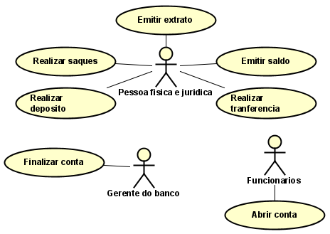

# Tarefa presente no estudo de Caso do SISTEMA BANCÁRIO
1. Requisitos funcionais

**Nome** | **Descrição** |
--  | -- |
Abrir conta | Pode ser iniciado uma nova conta por um funcionario do banco |
Excluir conta | Uma conta pode ser excluida pelo gerente do banco |
Sacar | É possivel que o cliente saque dinheiro |
Transferir | É possivel que o cliente tranfira dinheiro |
Ver Saldo | É possivel que o cliente verifique o proprio saldo |
Depositar | É possivel que o cliente deposite dinheiro |
Extrato | É possivel que o cliente emita seu extrato |

2. Caso de uso

<!---->

3. Detalhamento

**Caso** | **Detalhes** |
-- | -- |
Criar conta | Toda conta do tipo poupança ao ser aberta deve ter um depósito inicial. |
Excluir conta | Toda conta para ser finalizada deve estar com seu saldo zerado. |
Contas criadas | Contas do tipo corrente e poupança não permitem saldo negativo. Já a conta especial poderá estar negativa dependendo do limite de cada cliente. |
